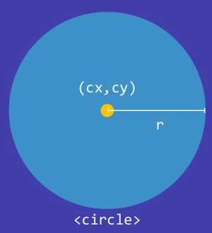
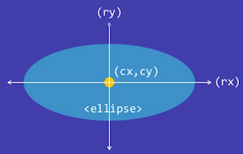
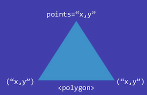
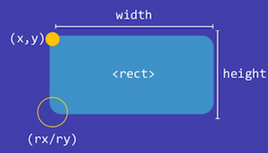
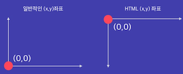
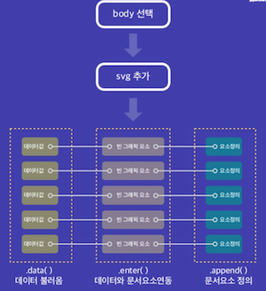

#D3.js

##개념
- Data-Driven-Documets 데이터 중심의 문서이고 `html`, `css`, `svg`를 활용해 시각화 결과물을 생성한다.
- 사용자가 입력한 시각화 규식을 바탕으로 데이터를 반영해 시각화 결과물을 생성한다. 
- 다양한 인터렉트비 기능 지원, 백터 이미지 지원, 데이터와 시각적 요소 연동
- 오래된 브러우저 지원 안함, 비트맵 이미지 지원안함, 원본데이터 숨기지 못함


###SVG
- 웹용 백터 그래픽
- html문서에 직접 포함시키거나 삽입 할 수 있다.
- 인터넷 익스플로러 8이하 빼고는 모든 브라우저 지원

###설치
```html
<script src="https://d3js.org/d3.v3.min.js"></script>
```

##동작과정
1. 데이터 Loading 
	- tsv, csv, json 등 다양한 형식의 데이터 연동가능

2. 데이터 Binding
	- 시각적 요소안에 데이터 수치를 입력한 코드에 맞춰 연동시킴
3. 시각적요소지정(Transforming)
	- 그래프 유형, 요소의 색상, 축과 범례 여부등 다양한 요소 지정가능
4. 사용자 반응 지정(Transitioning)
	- 클릭, 드래그 등 사용자 반응에 따른 효과 지정가능

##코드
서울시 구별 남여 인구 분포 데이터를 가져와 D3js로 그려보았다.

```javascript
d3.csv(url, function(error, data){
  data.forEach(function(d,i){
    // console.log(data);
    //데이터불러오기
    d.male =+d.male;
    d.female=+d.female;
  });
  //가로,세로,여백 설정
  var margin = {top:20, right:40, bottom:30,left:40},
      width =1000 - margin.left + margin.right,
      height = 600 - margin.top - margin.bottom;

  //x,y척도 설정
  var xScale = d3.scale.linear()
                .domain([0,d3.max(data, function(d){return d.male;})])
                .range([0,width]);
  var yScale = d3.scale.linear()
                .domain([0,d3.max(data,function(d){return d.female;})])
                .range([height,0]);

  //x축설정
var xAxis = d3.svg.axis()
            .scale(xScale)
            .orient("bottom");
//y축설정
var yAxis = d3.svg.axis()
            .scale(yScale)
            .orient("left");

//SVG 틀 그리기~
var svg = d3.select(".chart")
          .append("svg")
          .attr("width",width+margin.left+margin.right)
          .attr("height",height+margin.top+margin.bottom)
          .append("g")
          .attr("transform","translate("+margin.left+","+margin.top+")");

//x축그리기
svg.append("g")
    .attr("class","axis")
    .attr("transform", "translate(0,"+height+")")
    .call(xAxis)
    .append("text")
    .text("남자인구")
    .attr("transform","translate("+(width-margin.right)+",-10)");

//y축그리기
svg.append("g")
    .attr("class","axis")
    .call(yAxis)
    .append("text")
    .text("여자인구");

//산포도 점찍기
svg.selectAll("circle")
    .data(data)
    .enter()
    .append("circle")
    .attr("cx",function(d){
      return xScale(d.male);
    })
    .attr("cy",function(d){
      return yScale(d.female);
    })
    .attr("r",5)
    .attr("fill","#19BDC4");

//점에 데이터명 설정
svg.selectAll(".labeltext")
    .data(data)
    .enter()
    .append("text")
    .text(function(d){
      return d.area;
    })
    .attr("x",function(d){
      return xScale(d.male);
    })
    .attr("y",function(d){
      return yScale(d.female)-10;
    })
    .attr("font-family","sans-serif")
    .attr("font-size","10px")
    .attr("fill","#888888")
    .attr("text-anchor","middle");
});
```

##참고 그림






--
###Reference
- [@neuroassociates_sildeshare](http://www.slideshare.net/neuroassociates/presentations)
